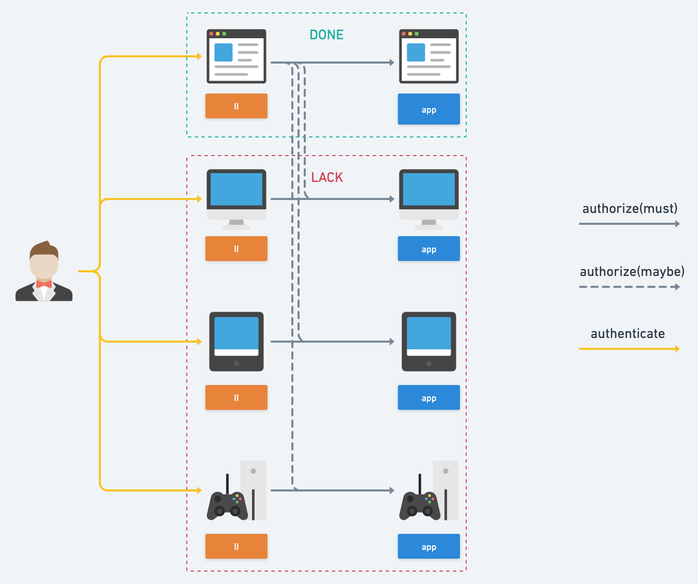
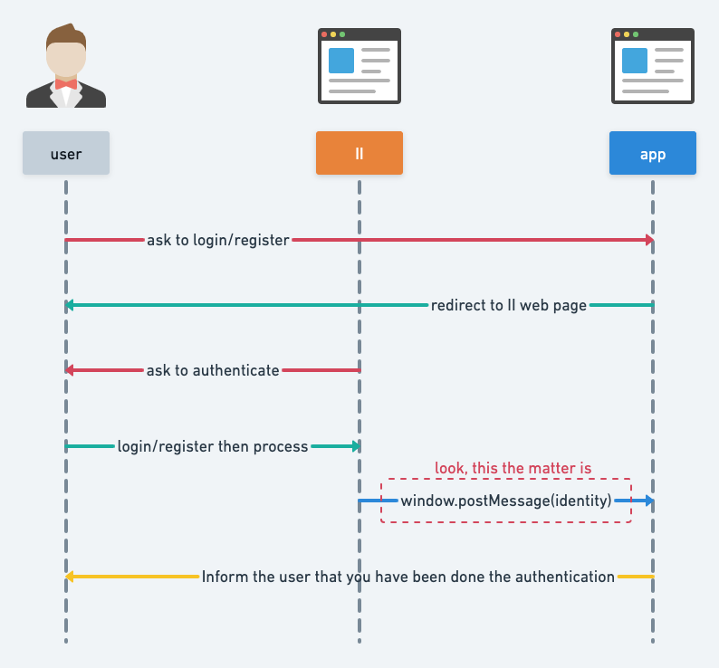
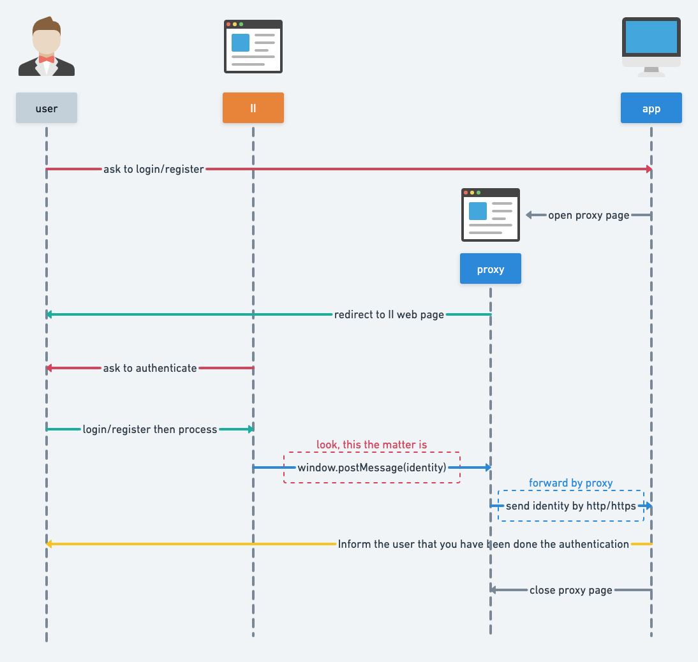
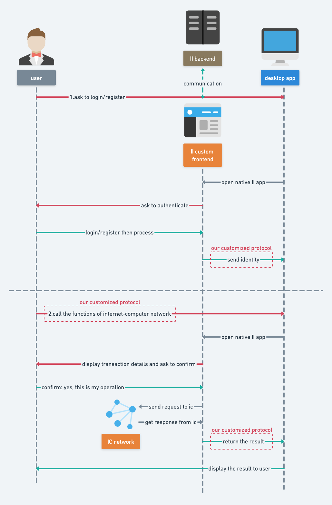

+++
title = "|ShiKu-Labs| II调查报告 V0"
date = 2022-04-11

[extra]
bgcolor = "bg-teal-500"
+++

这是团队基于过去两周的调研结果给出的报告，这里提出的一些技术方案可能会在后续深入研究中因为各种原因遭到调整或废弃，望知悉。
<!-- more -->

## 愿景

`II(Internet Identity)`是进入`IC(Internet Computer)`生态的通行证.

用户通过`II`, 向应用授权, 批准应用读取其`身份(Identity)`, 之后应用向该`身份`提供服务.

我们希望, 不论是web应用 还是native应用(desktop, console, mobile), 都能以最合适的方式, 接入`II`服务, 从而参与`IC`生态.

## 现状

因为IC生态处于早期阶段，`II`的授权服务目前只支持**web端应用**，其他的授权形式，需要我们去探索（这也是机会所在）。

如上图所示, 用户在`II`完成`验证(authentication)`和`授权(authorization)`后, `II`会将用户的身份信息通过`window.postMessage()`的方式传递给应用, 但`window.postMessage()`该方式仅能适用于浏览器的窗口与窗口之间, `II`无法将用户的身份信息传递到浏览器外部，这也是为什么**非web应用**也就无法获得`II`的授权服务了。

## 肮脏的黑魔法：desktop端应用接入II授权服务

从现状来看，`II`是不支持直接向**desktop应用**提供授权服务的，但通过一些比较*trick*的方式，我们可以间接的让`II`向**desktop应用**传递用户的身份信息。

这里必须强调，**该方案没有实际的应用价值，但有学习和研究的价值**，可以帮助团队理解`II`的授权流程，粗略了解一些密码学知识以及现行的加密方案。

实际上, 在`internet-identity`的[社区讨论(agent-dart作者发起)][1]中，官方有说明, 在未来阶段, 会支持`II(web端)`向**desktop应用**提供授权服务（但鉴于该讨论发生在去年7月份，所以这个‘未来’，看来，有些遥遥无期）。

## 更近一步

所以，根据`II`的现状，作为社区的参与者，我们有许多工作要做；但工作路线的方向，工期，预期成果都是需要考虑的，需要团队讨论。

所以，根据当前的调研成果，总结出了三条路线。

1. 前端Native化

    已知, `Internet Identity`是部署在`IC`上的`Canister`, `Canister`由前端(js/ts, css, html)和后端(motoko, rust, ..)组成。现在的问题是`II`的前端过于拉胯，只能为web应用提供授权服务，所以思路之一就是绕过`II`前端，直接与`II`后端进行交互

2. 让Unity直接访问IC, 自定义内部II前端: agent接口c#版实现

    **agent**是一套与`IC`进行交互的接口，理论上来说，`IC`应为每一种活跃的语言实现这一套**agent**接口；但现在**agent**接口仅有**javascript(agent-js: 官方维护)**, **rust(agent-rs: 官方维护)**, **dart(agent-dart: 社区维护)** 三种语言的实现。

    所以应用若想要最丝滑的`II`登陆/注册体验，则需要自己实现一套`II`前端，与`II`后端直接交互，这样用户直接就可以在应用内部进行`II`登陆/注册，而不需要外部跳转。而这一切的前提是要有**agent接口的c#实现**。

3. 坐等`II`团队推新特性 🥲

## 之后的工作

这是一份初期的调查报告，其中提出的方案，其可行性并没有经过严格的论证（不论是从技术上，还是从产品上）。所以未来的工作中调研依然占比较大的比重，一是从商业的角度研究上述方案的可行性(功能，前景，竞争对手)，二是从技术角度研究上述方案的可行性（是否有实现的可能，成本如何等），三是集思广益，看看还有没有什么其他方案还没有被挖掘。

[1]: https://github.com/dfinity/internet-identity/issues/332#issuecomment-878435351