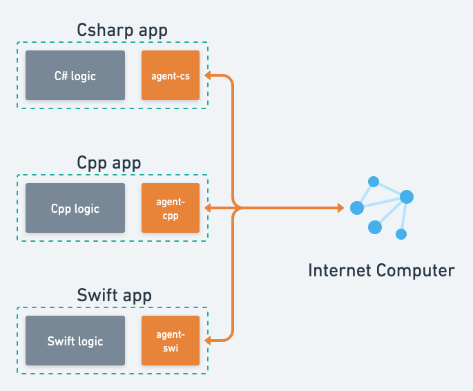
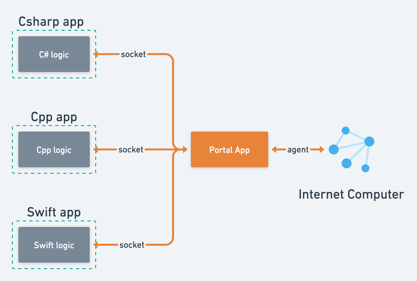

+++
title = "|ShiKu-Labs| Portal产品设计草案V0"
date = 2022-04-18

[extra]
bgcolor = "bg-teal-500"
+++

当前native应用缺乏与IC交互的手段，Portal希望在两者间充当中介，为应用开发者提供舒适的开发体验(指接入IC生态)。
<!-- more -->

## 痛点1(开发层面): 应用如何与IC进行交互

**Internet Computer(IC)**, 是部署在英特网上的分布式应用; 外部若想与IC进行交互, 则需要使用agent接口。agent是一套规范，它主要描述了如何构造Actor(智能合约的实例, 用于与部署在IC上的智能合约交互)以及如何构造Agent(用户实例: 用于对交互操作签名)。

IC现有的agent接口实现有: agent-js(官方), agent-rs(官方), 以及agent-dart(社区)。可以发现, 对于native应用而言(Java, Cpp, Csharp, Swift..), 想接入IC生态, 的确不是一件容易的事, 因为首先, 它们得为自己选择的语言实现agent接口规范(例如agent-java, agent-cpp, agent-cs..)。

### 传统方式

假如没有Portal, 那么native应用想要与IC交互, 就类似于下图:



在使用上, 类似于下面:

```js
import fetch from "node-fetch";
import { Actor, HttpAgent } from "@dfinity/agent";
import { idlFactory } from "./root.did.js";
import { Principal } from "@dfinity/principal";

// 1. 指定连接的主网, 以及用户身份(这里没填, 可以是传统的私钥, 或webAuth)
const agent = new HttpAgent({ host: "https://ic0.app", fetch: fetch });

// 2. 构造Actor, 需要智能合约的Id以及Candid(一种描述智能合约的文件)
const principal = Principal.fromText("rdmx6-jaaaa-aaaaa-aaadq-cai");
const actor = Actor.createActor(idlFactory, { agent: agent, canisterId: principal });

// 3. 调用智能合约并输出结果
const result = await actor.stats();
console.log(result);
```

emm, 乍看之下使用起来还是满方便的, 但实际使用起来, 却会面临很多的问题。

### 传统方案的缺点

1. 假如agent并没有你偏好语言的实现, 那么你必须亲自动手写一个, 或者等社区帮你实现;
2. 涉及到update的智能合约交易, 需要用户对交易进行签名, 那么如何取信用户, 让他相信你不会拿着他的私钥去作恶?
3. 假如我想让用户通过II(Internet Identity)来登陆我的应用, 该怎么做, 徒手撸出II前端与II后端交互? 这可是个大活儿。
4. 我想要与智能合约交互, 害得获得智能合约的接口描述(Candid), 构造Actor, 能不能直接通过智能合约Id调用合约功能?
5. 智能合约更新了咋整, 下载新的Candid然后再编译?

### Portal提供的解决方案

事实上, 你可以把agent理解成一种语言(指现实中的语言, 例如英语), agent-js就是一本双向词典, js应用拿着这本词典与只会讲agent语言的IC进行沟通; 同样agent-rs, agent-dart也是如此。

而Portal给的方案, 就是把agent-xx词典活化, 变成一个翻译, 站在中间, 帮助应用与IC进行沟通。

相比于传统的方案, Portal仅需要支付一点代价(使用者需要安装Portal), 就可以直接与IC进行沟通; 而不需要使用agent-xx, 避免其带来的问题。



使用上类似下列代码:

```rust
// portal即连接Portal应用的websocket
let response = await portal.query("rdmx6-jaaaa-aaaaa-aaadq-cai", "stats");
println!(response);
```

### Portal方案的优缺点

相比于传统方式, Portal方案有以下优点:

1. 语言无关, 只要语言支持websocket协议(绝大部分都支持), 就能与Portal建立连接, 之后通过简单的**json-rpc**与IC进行代理沟通;
2. update交易的签名部分由Portal代劳(换句话说, Portal会提供一个类似钱包的功能), 且Portal计划开源, 解决用户信任问题;
3. Portal会将一些重要的IC应用(例如II)集成, 并提供简单的接口给应用, 例如II登陆;
4. 使用Portal无需管理Candid(一种智能合约接口描述, IDL), 指定智能合约Id即可调用合约功能;
5. 提供智能合约Id, 自动获得智能合约描述;

但也不是没有缺点:

1. 需要下载Portal应用, 没有Portal的话应用将无法使用;
2. 需要对websocket进行简单封装;
3. 因为使用的是json-rpc, 需要自主对类型进行转换;

## 痛点2(开发层面): Native应用如何获得用户身份信息

可以看这里, [上篇](https://allenpocket.work/ii-research-report-v0/#xian-zhuang)介绍过。

### Portal提供的解决方案

Portal会集成II(II分为前后端两部分, portal模拟II前端与II后端进行交互), 并向应用提供简单接口, 方便其获取用户身份;

Portal同时会提供一个钱包功能, 方便没有安全硬件的用户使用传统的私钥来保存其账户。

### 基于方案的未来衍生

随着IC生态的发展, Portal会集成一些公益的, 重要的IC应用进来(例如NFT系统, IM系统, 拍卖系统..), 向应用暴露一些封装后的接口, 方便应用快速开发, 与IC形成联动。

## 痛点3(开发层面): Native应用接入IC生态的开发套件

在开发的时候, 开发者希望能在本地环境进行测试, 他们往往需要自定义部署一些智能合约, 控制部分智能合约的状态, 检查发送/接收的包裹中的内容, 监控IC网络的状态等等。

我们希望, Portal应用之后能为这些开发者提供一套开发套件(与dfx不同, dfx是针对web应用开发的开发套件, 且在windows环境中难以使用, wsl不算), 满足他们这些需求。

1. 本地测试网

Portal会向开发者提供IC本地测试网, 方便本地测试(对windows环境比较急迫);

2. 智能合约搜索/上传/下载/安装

本地测试的时候, 因为应用依赖一些主网的智能合约, 需要测试网也配置这些智能合约。Portal应提供智能合约的下载/安装服务, 将主网的智能合约快速安装到本地, 完成测试环境部署。

同样, 本地开发的智能合约也可以快速上传到主网, 类似dfx套件提供的功能;

3. 包裹的拆解

很多时候, 开发者要确认IC或应用发送的包裹符合预期, 要对包裹拆开进行检查(拆包); Portal会提供历史面板, 列出通过Portal传递的所有包裹信息, 帮助开发者更好的定位问题。

## 痛点4(开发层面): 类websocket协议

IC当前并不支持双工协议(长时间, 双向通信), 这对很对应用的开发造成了困难。

相关讨论可以看这篇[关于websocket支持的帖子](https://forum.dfinity.org/t/websocket-support/1869/5), 其中说明了当前的双工协议的patch方法(使用轮询), 和IC实现双工协议的难点, 以及可能的方案。

而在Portal这里, 可以向开发者提供伪双工协议, 隐藏其具体实现(使用轮询), 提升开发体验。